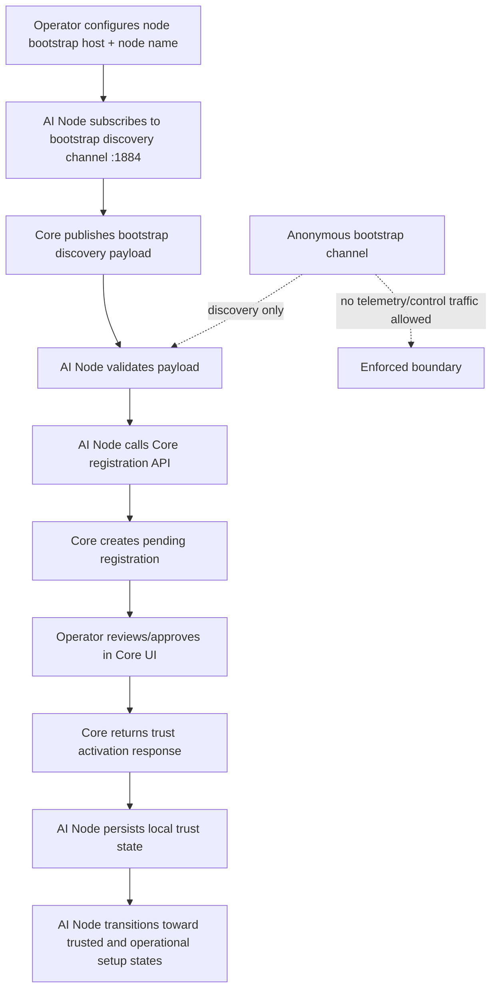

# Synthia AI Node - Phase 1 Overview

Status: Planned
Implementation status: Not developed
Last updated: 2026-03-11

## Purpose

Status: Planned

Phase 1 establishes AI Node onboarding into the Synthia system.

This phase focuses only on:

- bootstrap discovery
- node registration with Core
- operator approval
- trust activation
- local persistence of node trust state

Phase 1 does not implement AI execution, provider orchestration, or prompt workflows.

## Phase 1 Responsibilities

Status: Planned

1. Node bootstrap discovery via MQTT.
2. Node registration with Core API.
3. Operator approval through Core UI.
4. Trust activation payload acceptance.
5. Local storage of node trust state.
6. Node lifecycle status publication.

## Out of Scope (Future Phases)

Status: Planned

- AI execution
- OpenAI provider runtime integration
- prompt registration/governance
- provider configuration UX
- capability declaration processing
- runtime manager/model management
- cost or budget enforcement
- task routing

## Phase 1 System Diagram

Status: Planned

### Minimal Data Flow Notes

Status: Planned

- Bootstrap discovery is anonymous, subscribe-only from node perspective, and limited to discovery metadata.
- Registration is API-based and deterministic after valid bootstrap data is observed.
- Approval is operator-mediated in Core UI and gates trust activation.
- Trust activation response includes node identity and operational trust material.
- Local persistence is required for reboot-safe pairing continuity.

### Bootstrap Boundary Constraint

Status: Planned

- Telemetry or control commands must not run over anonymous bootstrap transport.
- Operational telemetry/control requires trusted operational identity and channels after trust activation.

## See Also

- [AI Node Architecture](./ai-node-architecture.md)
- [AI Node Capability Declaration](./node-capability-declaration.md)
- [Synthia Platform Architecture](../../Synthia/docs/platform-architecture.md)
- [Synthia MQTT Platform](../../Synthia/docs/mqtt-platform.md)
- [Synthia API Reference](../../Synthia/docs/api-reference.md)
